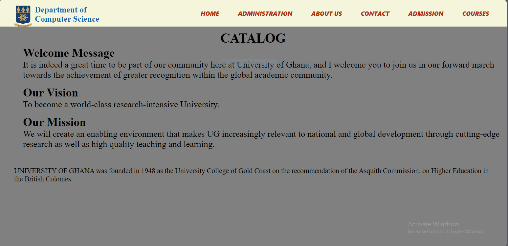
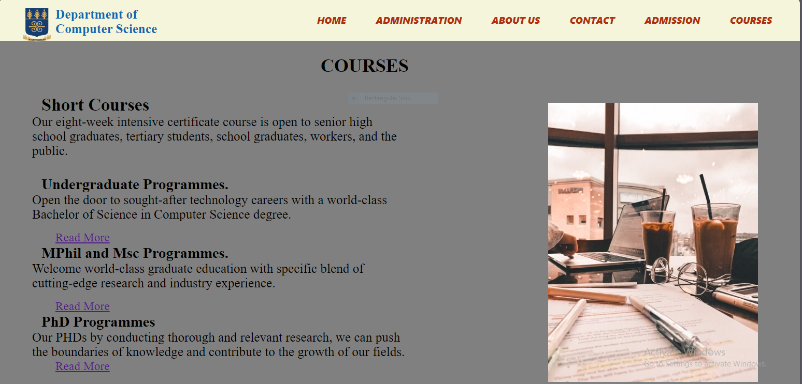
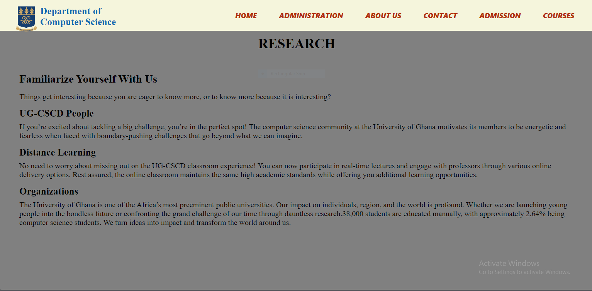

# DCIT_205_IA
# NAME: Abigail Afful
# ID: 11016236
# INTRODUCTION

Welcome to the _README_ for our computer science department website project! Here provides a  brief  overview of the project, its purpose, and key information for everyone involved in the development of the departmental website of  the school.This project was built using only HTML and CSS.

## PURPOSE
The purpose of this website is to provide helpful information about the University of Ghana Computer Science Department and also facilitate communication and interaction with users through features like our contact form and social media integration. 

# 2. How To Clone And Setup The Project
_Here is a detailed instructions on how to setup the project_

## Clone the repository
.Open a terminal or command prompt and run the following command to clone the repository
.git clone https://github.com/your-username/11016236_DCIT205.git
. Replace "your-username" with your Github username.

## Navigate to the Project Directory
.Change into the project directory
.cd 11016236_DCIT205

## Install Dependencies 
.Run the following command to install the project dependencies:
.npm install

## Set Up Environmental Variables
.Check if there's a file named '.env.example' in the project root. If it exists, duplicate it and rename the copy to '.env.' Open the '.env.' file and configure any neccessary environment variables, such as API keys or database connection strings.

## Run The Development Server 
.Start the development server with the following command:
.npm start
.This will launch the development server, and you should see output indidcating that the server is running.The website will be accessible at http://localhost:3000 by default.

## Access the School Website
.Open your web browser and navigate to http://localhost:3000. You should use the school website running locally.

# Screenshots of the Pages On The Website

# Lessons Learnt From The Project
-I learnt that a website can raech people from all the overworld, 24/7. It provides a platform for anyone for anyone to access your information, products, or services at any time.

-A website can be a powerful tool, allowing you to promote your brand, share valuable content, and attract more visitors and customers.

-A website allows you to establish an online presence and showcase your work, products, or services to a wider audience.

-A well-designed and functional website can enhance your credibility and make you appear more professional in the eyes of potential clients or customers.